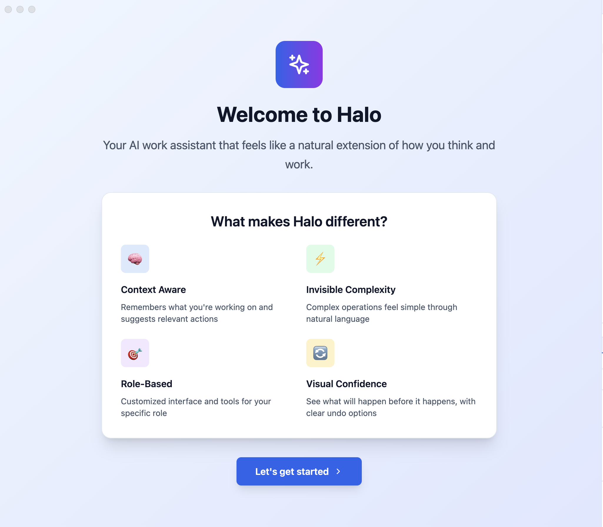

# Halo Desktop

## AI-Powered Desktop Assistant for Everyone

Halo is a user-friendly desktop application that brings the power of AI to your fingertips. Built with Electron and React, it provides a seamless interface for AI-powered productivity without requiring technical expertise.

### 📥 [Download Latest Release (v1.0.0)](https://github.com/alinaqi/halo/releases/latest)




## ✨ Features - Phase 1 MVP Complete!

### 🎯 Core Features
- **👤 Personalized Onboarding**: Role selection for customized experience (PM, Designer, Marketing, Developer, etc.)
- **🔐 Secure Authentication**: Connect with your Anthropic API key or use Quick Start mode
- **💬 AI Chat Interface**: Natural language interaction with context-aware suggestions
- **📁 File Management**: Full-featured file explorer with create, edit, delete, and search
- **✅ Task Management**: Complete task system with priorities, filtering, and persistence
- **🧠 Memory System**: Context retention across sessions with smart suggestions
- **⚡ YOLO/Careful Modes**: Choose between fast execution or safe confirmations
- **🎨 Adaptive UI**: Role-based dashboards and personalized workflows
- **🌓 Theme Support**: Light, Dark, and Auto theme modes

### 🚀 Key Capabilities
- **Smart Suggestions**: Time and context-aware recommendations
- **Role-Specific Dashboards**: Tailored interfaces for different professions
- **Project Tracking**: Monitor progress, deadlines, and blockers
- **Conversation Memory**: Remembers context from previous interactions
- **File Operations**: Browse, edit, search, and organize files
- **Task Workflows**: Create, prioritize, and track tasks with statuses
- **Settings Management**: Comprehensive preferences and customization

## 🚀 Quick Start (For Users)

### Download & Install

1. **[Download Halo Desktop](https://github.com/alinaqi/halo/releases/latest)**
   - macOS: Download the `.dmg` file
   - Windows: Coming soon
   - Linux: Coming soon

2. **Install**
   - macOS: Open the DMG and drag Halo to Applications
   - Windows: Run the installer
   - Linux: Make AppImage executable and run

3. **Launch & Setup**
   - Open Halo from your Applications/Start Menu
   - Choose your role (PM, Designer, Developer, etc.)
   - Enter your API key or use Quick Start mode

## 💻 Development Setup

### Prerequisites
- Node.js 18.0.0 or higher
- npm or yarn
- An Anthropic API key (optional - Quick Start mode available)

### Installation

1. Clone the repository:
```bash
git clone https://github.com/alinaqi/halo.git
cd halo
```

2. Install dependencies:
```bash
npm install
```

3. Set up environment variables (optional):
Create a `.env` file in the root directory:
```env
ANTHROPIC_API_KEY=your_api_key_here
```

4. Start the application:
```bash
npm run dev
```

### Building for Production

#### Build for your current platform:
```bash
npm run build
npm run dist
```

#### Build for specific platforms:
```bash
# macOS
npm run dist:mac

# Windows
npm run dist:win

# Linux
npm run dist:linux
```

## 🆕 What's New in Phase 1 MVP

### Latest Features
- ✅ Complete Task Management System with priorities and filtering
- 🧠 Smart Memory Service for context retention
- ⚡ YOLO/Careful operation modes
- 🎨 Comprehensive Settings Panel
- 👤 Role-based UI adaptation
- 🌓 Dark/Light/Auto theme support
- 💾 Local data persistence
- 🔍 Advanced file search capabilities

## 🏗️ Architecture

Halo is built with a modern, secure architecture:

- **Frontend**: React + TypeScript + Tailwind CSS
- **Desktop Framework**: Electron
- **Build Tool**: Vite
- **AI Integration**: Anthropic SDK
- **State Management**: React Context + Memory Service
- **Storage**: localStorage + Electron secure storage
- **Security**: Electron's contextIsolation and secure IPC

### Project Structure
```
halo/
├── electron/           # Electron main process
│   ├── main.cjs       # Main entry point
│   ├── preload.cjs    # Preload script for security
│   └── services/      # Backend services
├── src/               # React application
│   ├── components/    # UI components
│   ├── contexts/      # React contexts
│   ├── hooks/         # Custom React hooks
│   └── lib/           # Utility libraries
├── dist/              # Production build output
└── release/           # Electron distribution packages
```

## 🔒 Security

- API keys are encrypted and stored locally using Electron's safeStorage API
- No data is sent to external servers except for AI API calls
- Context isolation ensures web content cannot access Node.js APIs directly
- All file operations are sandboxed to designated workspace directories

## 🤝 Contributing

We welcome contributions! Please see our [Contributing Guide](CONTRIBUTING.md) for details.

### Development Workflow

1. Fork the repository
2. Create a feature branch (`git checkout -b feature/amazing-feature`)
3. Commit your changes (`git commit -m 'Add amazing feature'`)
4. Push to your branch (`git push origin feature/amazing-feature`)
5. Open a Pull Request

## 📄 License

This project is licensed under the AGPL-3.0 License - see the [LICENSE](LICENSE) file for details.

## 🙏 Acknowledgments

- Built with [Electron](https://www.electronjs.org/)
- UI powered by [React](https://reactjs.org/) and [Tailwind CSS](https://tailwindcss.com/)
- AI capabilities via [Anthropic](https://www.anthropic.com/)
- Icons from [Lucide React](https://lucide.dev/)

## 📞 Support

- **Issues**: [GitHub Issues](https://github.com/alinaqi/halo/issues)
- **Discussions**: [GitHub Discussions](https://github.com/alinaqi/halo/discussions)

---

**Halo Desktop** - Making AI accessible to everyone 🚀